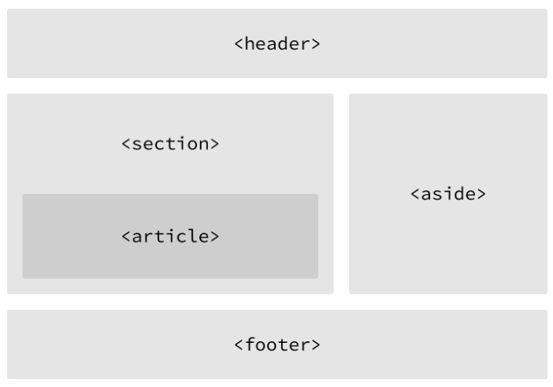

# ShayHoweHTMLCSS
A reading notes of Learn to Code HTML &amp; CSS by Shay Howe.

## HTML & CSS

### Lesson 2. Getting to Know HTML

#### Semantic Elements

Semantic elements describe the meaning of their contents, for example, `
` specifies its content is a paragraph, while `
` and `` are generic containers for styling purposes. 

- `
`: a block-level element that is commonly used to identify a large group of contents.
- ``: an inline-level element that is commonly used to identify a smaller group of contents.

#### Structurally Based Elements

